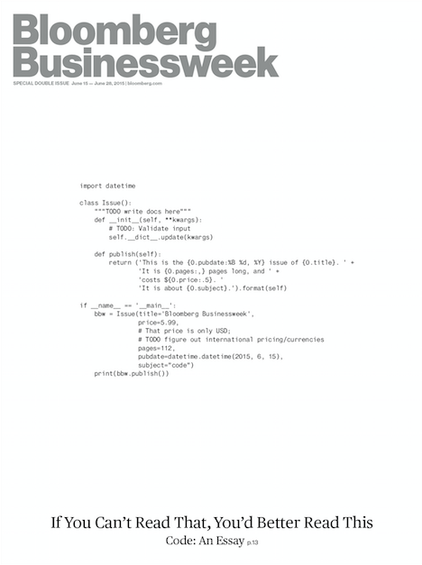
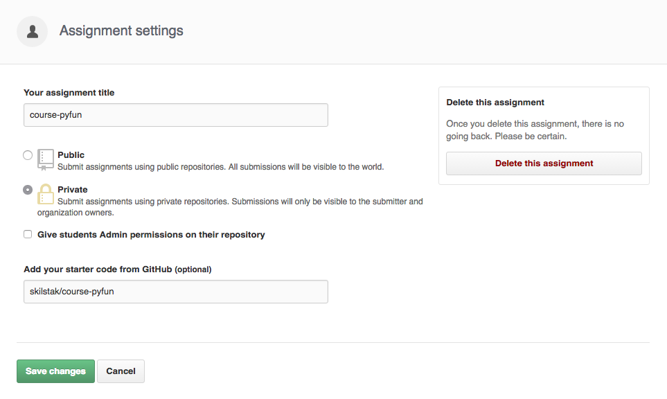

# Programming Fundamentals in Python 3

## What We Learn

In this course students find out what coding is, why they should
learn it, and how. Students focus on programming fundamentals such
as variables, operators, blocks, logic, loops, data types, lists,
dictionaries, functions, exceptions, unit testing, classes, files,
json, web api consumption, and basic code organization.

Students gradually learn the same habits, tools, and workflows
associated with college computer science programs and technical
careers. We code using `vim` from the command-line the way most
experienced professionals do. If you insist, you can also use the
[Atom](http://atom.io)-like editor with
[codeanywhere.com](http://codeanywhwere.com).

Students learn modern Python (3.4+ not 2.7) for many obvious reasons.

## Assignments

* [Hello World! (`hello`)](hello)
* [Hi You! (`hi`)](hi)
* [Nyan, Nyan, STOP! (`nyan`)](nyan)
* [Do You Like Waffles? (`waffles`)](waffles)
* [Dice Roll (`roll`)](roll)
* [Badgers, Badgers, Badgers (`badgers`)](badgers)
* [Magic Eightball (`eightball`)](eightball)
* [Bridge Keeper (`bridge`)](bridge)
* [Arguing with Commander Lion (`lion`)](lion)
* [Multiplication Tables (`mtable`)](mtable)
* [Mad Forms (`madforms`)](madforms)
* [Binary Counter (`bincount`)](bincount)
* [Quiz Game (`quiz`)](quiz)
* [Blinky Lib (`blinky`)](blinky)
* [Arena (`arena`)](arena)
* [Battleship (`battle`)](battle)
* [Pokeapi (`pokeapi`)](pokeapi)
* [Story Engine (`story`)](story)

## More Python 3 Learning Resources

Wanna take your skills beyond the fundamentals? Here are some
resources to keep you going.

* [Dive Into Python 3](www.diveintopython3.net)
* Do NOT use codeacademy.com to learn Python since it is Python 2.

## To Teachers

**Time and Scheduling:** The assignments in this course are designed
to fill about 90 minutes a week of class time for a little over 16
weeks (about one semester in most schools).

**Age:** The content is designed with students ages 8 to 18 in mind but has
been completed by college age students and adults as well.

**Just the Fundamentals:** It is important to note this course
covers only basic Programming Fundamentals that are pretty much
universal to all languages.  Python-specific features, such as
comprehensions, are not covered.

**Supplemental Project:** Ideally these assignments will be coupled
with an ongoing project of the student's choosing in which they can
apply what they are learning as well as display on their public
GitHub repo to the world demonstrating what they have learned. Such
a project would help motivate students to progress farther on their
own as they learn the more advanced features of Python.

**Rubrics:** This course contains no rubrics since these differ
greatly. At SkilStak we prefer to simply check for completion and
supplement this course with a
[certification](http://github.com/skilstak/course-pyfun-certification). In
fact, not unlike learning martial arts, many students may need to
repeat these assignments a few times to gain full mastery sufficient
to certify.

**GitHub Classroom:** This course is setup to work well with
`classroom.github.com` and we encourage it. Because everything in
this repo is released to the public domain you should have no problem
setting up an "assignment" as follows for use with your own students.

Using GitHub classroom with private repos allows students to work
without the worry of being scrutinized by peers and the public. (We
don't worry about cheating so much—especially since the solutions
are all in `.solutions` of every assignment). This also keeps
students personal GitHub repos uncluttered with educational repos
that might dissuade a potential employer or school admission leaving
only the student's individual creations in their repos.

**Follow Up Possibilities: ** 
This course is designed to prepare students to be proficient with
Raspberry Pi programming in Python later. Specifically the [*Blinky
Lib*](blinky) created can be modified to work with simple LED lights
from a basic breadboard connected to it.

Many of the command line skills also build into server-side scripting
from the command line in the Linux course where basic Ethical Hacking
is also introduced.

Go lang programming usually comes after this course as well since
students become familiar with command-line programming in Python
before moving on.

## Author, License, Copyright, Etc.

This course was originally conceived and created by [Rob
Muhlestein](http://github.com/robmuh) for [SkilStak Coding
Arts](http://github.com/skilstak), a non-profit, private school
focused on technology. Please [report any issues or
suggestions](http://github.com/skilstak/course-pyfun/issues) you
may have, including additional assignments and other contributions
as pull requests. All source code and copy content in this repo is
released to the public domain as follows:

***The Unlicense***

This is free and unencumbered software released into the public
domain.

Anyone is free to copy, modify, publish, use, compile, sell, or
distribute this software, either in source code form or as a compiled
binary, for any purpose, commercial or non-commercial, and by any
means.

In jurisdictions that recognize copyright laws, the author or authors
of this software dedicate any and all copyright interest in the
software to the public domain. We make this dedication for the benefit
of the public at large and to the detriment of our heirs and
successors. We intend this dedication to be an overt act of
relinquishment in perpetuity of all present and future rights to this
software under copyright law.

THE SOFTWARE IS PROVIDED "AS IS", WITHOUT WARRANTY OF ANY KIND,
EXPRESS OR IMPLIED, INCLUDING BUT NOT LIMITED TO THE WARRANTIES OF
MERCHANTABILITY, FITNESS FOR A PARTICULAR PURPOSE AND NONINFRINGEMENT.
IN NO EVENT SHALL THE AUTHORS BE LIABLE FOR ANY CLAIM, DAMAGES OR
OTHER LIABILITY, WHETHER IN AN ACTION OF CONTRACT, TORT OR OTHERWISE,
ARISING FROM, OUT OF OR IN CONNECTION WITH THE SOFTWARE OR THE USE OR
OTHER DEALINGS IN THE SOFTWARE.

For more information, please refer to <http://unlicense.org>
